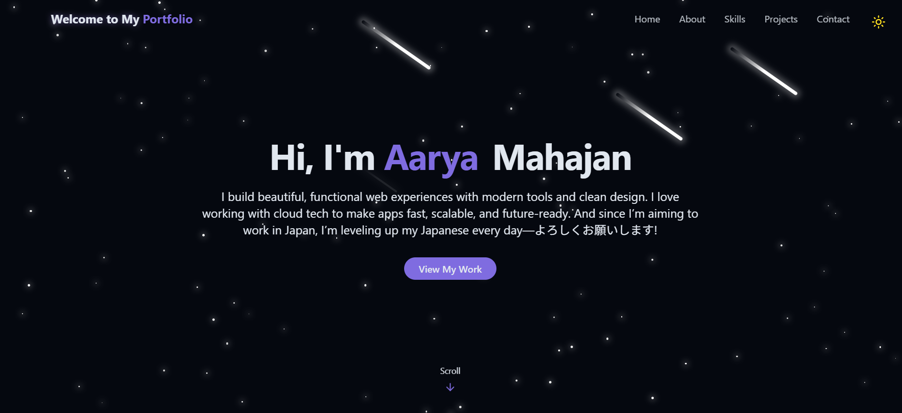
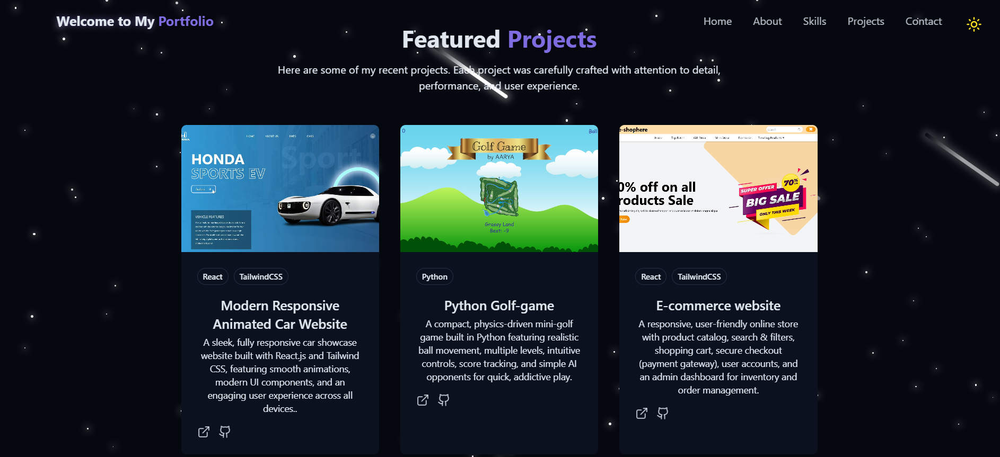

# Modern Portfolio Website with React & TailwindCSS

## portfolio website
* [Click here](https://beautiful-react-tailwind-portfolio-gr7hezaiq.vercel.app/)

<div align="center">
  <br />
    
    
  </a>
  <br />
  <div>
    
    
    
    
    
  </div>
  <h3 align="center">Created a Stunning Developer Portfolio with Animations, Dark Mode, and Projects Showcase</h3>
  <br />
</div>

## 📋 Table of Contents

1. [Introduction](#-introduction)
2. [Tech Stack](#-tech-stack)
3. [Features](#-features)
4. [Quick Start](#-quick-start)
5. [Screenshots](#-screenshots)
6. [Deployment](#-deployment)

---

## 🚀 Introduction

In this tutorial, I built a modern portfolio website using **React**, **TailwindCSS**, **Vite**, and **Lucide Icons**. From dark mode support to responsive animations and deployable project showcases.

---

## ⚙️ Tech Stack

* **React** – Component-based UI development
* **Vite** – Lightning-fast build tool
* **TailwindCSS** – Utility-first CSS for styling
* **Lucide Icons** – Clean and beautiful icon pack
* **Radix UI** – Accessible component primitives
* **GitHub**  – Deployment

---

## ⚡️ Features

* 🌑 **Light/Dark Mode Toggle**
  Save theme preference in local storage with beautiful transitions

* 💫 **Animated Backgrounds**
  Stars, meteors, scroll effects, and glowing UI elements

* 📱 **Responsive Navigation**
  Desktop and mobile menus with glassmorphism

* 👨‍💻 **Hero & About Sections**
  Showcase who am I with smooth intro animations and buttons

* 📊 **Skills Grid**
  Filterable progress bars and categories with animated width

* 🖼️ **Projects Showcase**
  Display screenshots, tech stacks, and GitHub/demo links

* 📩 **Contact Section**
  Social icons + responsive contact form with toast notifications

* 🚀 **One-Click Deployment**
  Easily host site with GitHub

---

## 👌 Quick Start

### Prerequisites

* [Node.js](https://nodejs.org/)
* [Git](https://git-scm.com/)

### Clone and Run

```bash
git clone https://github.com/aaryamahajan919/beautiful-react-tailwind-portfolio.git
cd beautiful-react-tailwind-portfolio
npm install
npm run dev
```

App will be available at: [http://localhost:5173](http://localhost:5173)

---

## ☁️ Deployment

### Deploy on Vercel

1. Push your code to GitHub
2. Go to [vercel.com](https://vercel.com)
3. Import your repository
4. Click **Deploy**

Your live website will be hosted on a custom subdomain (e.g. `https://your-name.vercel.app`)

---

## 🔗 Useful Links

* [React Documentation](https://reactjs.org/)
* [Tailwind CSS Docs](https://tailwindcss.com/)
* [Lucide Icons](https://lucide.dev/)
* [Radix UI](https://www.radix-ui.com/)
* [Vite](https://vitejs.dev/)
* [Vercel](https://vercel.com/)

---


